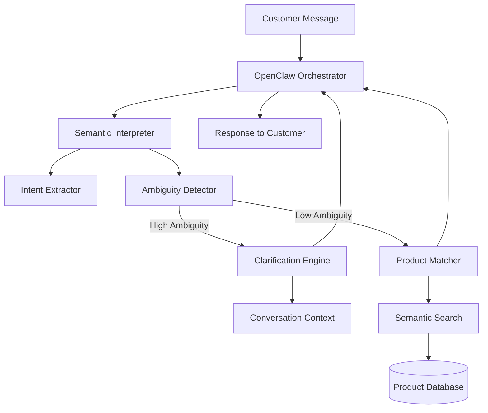

# Design Document: Intelligent Product Interpretation System

## Overview

The intelligent product interpretation system replaces tag-based keyword matching with semantic understanding and conversational clarification. The system analyzes customer intent using AI, detects ambiguity, asks clarifying questions when needed, and matches products based on semantic similarity rather than tags.

This design integrates seamlessly with the existing OpenClaw orchestrator, conversation strategy, and context services while introducing new components for semantic interpretation, ambiguity detection, and intelligent product matching.

## Architecture

### High-Level Architecture



### Component Interaction Flow

1. Customer sends message → OpenClaw Orchestrator
2. Orchestrator → Semantic Interpreter (analyze intent)
3. Semantic Interpreter → Intent Extractor (extract what customer wants)
4. Intent Extractor → Ambiguity Detector (calculate confidence scores)
5. If ambiguous → Clarification Engine (generate questions)
6. If clear → Product Matcher (find relevant products)
7. Product Matcher → Semantic Search (rank by similarity)
8. Results → Orchestrator → Customer

## Components and Interfaces

### 1. Semantic Interpreter Service

**Location**: `src/lib/bot/semantic-interpreter.ts`

**Purpose**: Analyzes customer messages to extract intent and detect ambiguity

**Interface**:
```typescript
interface IntentAnalysis {
  originalMessage: string;
  interpretations: Interpretation[];
  primaryIntent: Interpretation;
  ambiguityScore: number;
  requiresClarification: boolean;
  conversationContext?: string[];
}

interface Interpretation {
  intent: string;
  confidence: number;
  productType: 'physical' | 'digital' | 'service';
  category?: string;
  useCase?: string;
  keywords: string[];
  reasoning: string;
}

class SemanticInterpreterService {
  static async analyzeIntent(
    message: string,
    conversationHistory: any[],
    userId: string
  ): Promise<IntentAnalysis>;
  
  static async refineIntent(
    previousAnalysis: IntentAnalysis,
    clarificationResponse: string
  ): Promise<IntentAnalysis>;
}
```

**Key Methods**:
- `analyzeIntent()`: Main entry point for intent analysis
- `refineIntent()`: Updates intent based on clarification responses
- `extractKeywords()`: Extracts meaningful keywords (not tags)
- `calculateAmbiguity()`: Determines if clarification is needed

### 2. Clarification Engine

**Location**: `src/lib/bot/clarification-engine.ts`

**Purpose**: Generates specific clarifying questions when intent is ambiguous

**Interface**:
```typescript
interface ClarificationQuestion {
  question: string;
  options: string[];
  type: 'use_case' | 'product_type' | 'budget' | 'specifications';
  interpretations: string[];
}

class ClarificationEngine {
  static generateQuestions(
    analysis: IntentAnalysis,
    maxQuestions: number = 2
  ): ClarificationQuestion[];
  
  static formatQuestionForUser(
    questions: ClarificationQuestion[]
  ): string;
  
  static parseUserResponse(
    response: string,
    question: ClarificationQuestion
  ): { selectedOption: string; confidence: number };
}
```

**Key Methods**:
- `generateQuestions()`: Creates specific questions based on ambiguity
- `formatQuestionForUser()`: Formats questions in conversational Spanish
- `parseUserResponse()`: Interprets customer's answer

### 3. Product Matcher Service

**Location**: `src/lib/bot/product-matcher.ts`

**Purpose**: Matches products to customer intent using semantic similarity

**Interface**:
```typescript
interface ProductMatch {
  product: any;
  relevanceScore: number;
  matchReasons: string[];
  semanticSimilarity: number;
}

interface MatchingCriteria {
  intent: Interpretation;
  useCase?: string;
  budget?: { min: number; max: number };
  specifications?: Record<string, any>;
  excludeCategories?: string[];
}

class ProductMatcherService {
  static async matchProducts(
    criteria: MatchingCriteria,
    products: any[],
    limit: number = 5
  ): Promise<ProductMatch[]>;
  
  static async calculateSemanticSimilarity(
    intent: string,
    productDescription: string
  ): Promise<number>;
  
  static filterByUseCase(
    products: any[],
    useCase: string
  ): any[];
}
```

**Key Methods**:
- `matchProducts()`: Main matching logic using semantic similarity
- `calculateSemanticSimilarity()`: Uses AI to compare intent vs product
- `filterByUseCase()`: Filters products that don't match use case
- `rankByRelevance()`: Ranks products by multiple factors

### 4. Semantic Search Service (Enhanced)

**Location**: `src/lib/bot/semantic-search.ts`

**Purpose**: Provides semantic similarity calculations without tag dependency

**Interface**:
```typescript
class SemanticSearchService {
  static async searchByIntent(
    intent: string,
    products: any[],
    options?: {
      useEmbeddings?: boolean;
      excludeTags?: boolean;
      minSimilarity?: number;
    }
  ): Promise<ProductMatch[]>;
  
  static async generateEmbedding(text: string): Promise<number[]>;
  
  static cosineSimilarity(vec1: number[], vec2: number[]): number;
  
  static async semanticRank(
    query: string,
    candidates: string[]
  ): Promise<{ text: string; score: number }[]>;
}
```

**Key Methods**:
- `searchByIntent()`: Searches products by semantic meaning
- `generateEmbedding()`: Creates vector embeddings for text
- `cosineSimilarity()`: Calculates similarity between vectors
- `semanticRank()`: Ranks text candidates by semantic similarity

### 5. Integration with Orchestrator

**Modified**: `src/lib/bot/openclaw-orchestrator.ts`

**Changes**:
- Add semantic interpretation before tool selection
- Integrate clarification flow
- Use semantic product matching instead of fuzzy search

**New Flow**:
```typescript
async processMessage(messageText: string, from: string, context: any) {
  // 1. Analyze intent semantically
  const intentAnalysis = await SemanticInterpreterService.analyzeIntent(
    messageText,
    history,
    context.userId
  );
  
  // 2. Check if clarification needed
  if (intentAnalysis.requiresClarification) {
    const questions = ClarificationEngine.generateQuestions(intentAnalysis);
    return {
      text: ClarificationEngine.formatQuestionForUser(questions),
      needsClarification: true,
      pendingAnalysis: intentAnalysis
    };
  }
  
  // 3. Match products semantically
  const matches = await ProductMatcherService.matchProducts(
    { intent: intentAnalysis.primaryIntent },
    context.products
  );
  
  // 4. Continue with existing flow...
}
```

## Data Models

### Intent Analysis Model

```typescript
interface IntentAnalysis {
  // Original message
  originalMessage: string;
  
  // All possible interpretations
  interpretations: Interpretation[];
  
  // Most likely interpretation
  primaryIntent: Interpretation;
  
  // Ambiguity score (0-1, higher = more ambiguous)
  ambiguityScore: number;
  
  // Whether clarification is needed
  requiresClarification: boolean;
  
  // Context from conversation
  conversationContext?: string[];
  
  // Timestamp
  analyzedAt: Date;
}

interface Interpretation {
  // What the customer wants
  intent: string;
  
  // Confidence in this interpretation (0-1)
  confidence: number;
  
  // Type of product
  productType: 'physical' | 'digital' | 'service';
  
  // Category if identifiable
  category?: string;
  
  // Use case if mentioned
  useCase?: string;
  
  // Extracted keywords (not tags)
  keywords: string[];
  
  // AI reasoning for this interpretation
  reasoning: string;
}
```

### Product Match Model

```typescript
interface ProductMatch {
  // The matched product
  product: any;
  
  // Overall relevance score (0-1)
  relevanceScore: number;
  
  // Reasons why this product matches
  matchReasons: string[];
  
  // Semantic similarity score (0-1)
  semanticSimilarity: number;
  
  // Use case match (if applicable)
  useCaseMatch?: boolean;
  
  // Budget match (if applicable)
  budgetMatch?: boolean;
}
```

### Clarification Question Model

```typescript
interface ClarificationQuestion {
  // The question to ask
  question: string;
  
  // Possible options (if multiple choice)
  options: string[];
  
  // Type of clarification
  type: 'use_case' | 'product_type' | 'budget' | 'specifications';
  
  // Which interpretations this helps distinguish
  interpretations: string[];
  
  // Expected answer format
  expectedFormat?: 'choice' | 'text' | 'number';
}
```

### Conversation State Extension

```typescript
// Extension to existing ConversationContext
interface ConversationContext {
  // ... existing fields ...
  
  // Pending intent analysis awaiting clarification
  pendingIntentAnalysis?: IntentAnalysis;
  
  // Clarification questions asked
  clarificationHistory?: {
    question: ClarificationQuestion;
    answer: string;
    timestamp: Date;
  }[];
  
  // Customer requirements gathered
  customerRequirements?: {
    useCase?: string;
    budget?: { min: number; max: number };
    specifications?: Record<string, any>;
  };
}
```

## Correctness Properties

*A property is a characteristic or behavior that should hold true across all valid executions of a system—essentially, a formal statement about what the system should do. Properties serve as the bridge between human-readable specifications and machine-verifiable correctness guarantees.*

### Property 1: Intent Analysis Completeness

*For any* customer message, the Semantic Interpreter SHALL produce at least one interpretation with a confidence score.

**Validates: Requirements 1.1, 1.2**

### Property 2: Ambiguity Detection Consistency

*For any* intent analysis with multiple interpretations having similar confidence scores (difference < 0.2), the system SHALL flag the query as requiring clarification.

**Validates: Requirements 6.3, 6.4**

### Property 3: Clarification Question Relevance

*For any* ambiguous intent analysis, all generated clarification questions SHALL directly help distinguish between the identified interpretations.

**Validates: Requirements 2.1, 2.2**

### Property 4: Clarification Limit

*For any* conversation flow, the system SHALL ask no more than 2 clarifying questions before showing products or suggesting category browsing.

**Validates: Requirements 2.3**

### Property 5: Tag Independence

*For any* product search, the Product Matcher SHALL NOT use product tags as the primary filtering mechanism.

**Validates: Requirements 5.1, 5.2**

### Property 6: Semantic Similarity Ranking

*For any* set of products and a customer intent, products with higher semantic similarity to the intent SHALL be ranked higher than products with lower semantic similarity.

**Validates: Requirements 3.1, 3.2**

### Property 7: Use Case Filtering

*For any* product search with a specified use case, products that clearly don't match the use case SHALL be excluded from results even if keywords overlap.

**Validates: Requirements 3.4**

### Property 8: Context Refinement

*For any* intent analysis followed by a clarification response, the refined intent SHALL have higher confidence than the original analysis.

**Validates: Requirements 1.5, 2.4**

### Property 9: Conversation Context Integration

*For any* message analysis, the system SHALL consider the previous conversation history when interpreting intent.

**Validates: Requirements 7.1, 4.4**

### Property 10: Fallback Behavior

*For any* semantic interpretation failure, the system SHALL fall back to the existing search mechanism without crashing.

**Validates: Requirements 7.4**

### Property 11: Response Time Bounds

*For any* simple query (single product type, no ambiguity), the semantic interpretation SHALL complete within 2 seconds.

**Validates: Requirements 8.1, 8.2**

### Property 12: Multi-Category Recognition

*For any* query that could match products in multiple categories, the system SHALL identify all relevant categories.

**Validates: Requirements 9.1, 9.2**

### Property 13: Interpretation Logging

*For any* intent analysis, the system SHALL log the query, interpretations, and confidence scores.

**Validates: Requirements 10.1**

### Property 14: Product Selection Logging

*For any* product selection by a customer, the system SHALL log which interpretation led to that product being shown.

**Validates: Requirements 10.2**

## Error Handling

### 1. AI Service Failures

**Scenario**: Groq API fails or times out during intent analysis

**Handling**:
- Retry with exponential backoff (max 2 retries)
- Fall back to Ollama if available
- If all AI fails, use existing fuzzy search as fallback
- Log failure for monitoring

**Code Pattern**:
```typescript
try {
  const analysis = await SemanticInterpreterService.analyzeIntent(message, history, userId);
} catch (error) {
  console.error('[SemanticInterpreter] AI failure, falling back to fuzzy search');
  return await fallbackToFuzzySearch(message, products);
}
```

### 2. Ambiguity Detection Edge Cases

**Scenario**: All interpretations have very low confidence

**Handling**:
- If all confidence < 0.3, ask open-ended question
- Suggest browsing categories
- Don't force a match

**Example Response**:
```
"No estoy seguro de entender exactamente qué buscas. ¿Podrías darme más detalles? 
O si prefieres, puedo mostrarte nuestras categorías principales:
• Laptops y Computadores
• Cursos Digitales
• Megapacks
• Motos"
```

### 3. No Products Match Intent

**Scenario**: Semantic search returns no products above similarity threshold

**Handling**:
- Inform customer honestly
- Suggest similar categories
- Offer to show all products in related category

**Example Response**:
```
"No tengo productos que coincidan exactamente con lo que buscas. 
¿Te gustaría ver opciones en [categoría similar]?"
```

### 4. Clarification Loop

**Scenario**: Customer doesn't answer clarification questions

**Handling**:
- After 2 ignored questions, show general category results
- Don't repeat the same question
- Adapt to new context if customer changes topic

### 5. Invalid Clarification Response

**Scenario**: Customer's answer doesn't match expected format

**Handling**:
- Parse flexibly (accept variations)
- If completely unclear, rephrase question once
- After 1 rephrase, proceed with best guess

### 6. Performance Degradation

**Scenario**: Semantic search takes too long

**Handling**:
- Set timeout of 3 seconds for semantic operations
- If timeout, fall back to faster fuzzy search
- Log performance issues for optimization

## Testing Strategy

### Unit Testing

**Focus Areas**:
- Intent extraction from various message formats
- Ambiguity score calculation
- Clarification question generation
- Semantic similarity calculations
- Edge cases (empty messages, very long messages, special characters)

**Example Unit Tests**:
```typescript
describe('SemanticInterpreterService', () => {
  test('should extract intent from simple query', async () => {
    const analysis = await SemanticInterpreterService.analyzeIntent(
      'busco una laptop',
      [],
      'test-user'
    );
    expect(analysis.primaryIntent.productType).toBe('physical');
    expect(analysis.primaryIntent.category).toContain('laptop');
  });
  
  test('should detect ambiguity in "teclado" query', async () => {
    const analysis = await SemanticInterpreterService.analyzeIntent(
      'busco un teclado',
      [],
      'test-user'
    );
    expect(analysis.requiresClarification).toBe(true);
    expect(analysis.interpretations.length).toBeGreaterThan(1);
  });
});
```

### Property-Based Testing

**Configuration**:
- Library: fast-check (TypeScript property testing)
- Minimum 100 iterations per property test
- Tag format: **Feature: intelligent-product-interpretation, Property {N}: {description}**

**Property Test Examples**:

```typescript
import fc from 'fast-check';

describe('Property Tests: Intent Analysis', () => {
  test('Property 1: Intent Analysis Completeness', async () => {
    // Feature: intelligent-product-interpretation, Property 1: For any customer message, produce at least one interpretation
    await fc.assert(
      fc.asyncProperty(
        fc.string({ minLength: 1, maxLength: 200 }),
        async (message) => {
          const analysis = await SemanticInterpreterService.analyzeIntent(
            message,
            [],
            'test-user'
          );
          expect(analysis.interpretations.length).toBeGreaterThan(0);
          expect(analysis.primaryIntent).toBeDefined();
        }
      ),
      { numRuns: 100 }
    );
  });
  
  test('Property 2: Ambiguity Detection Consistency', async () => {
    // Feature: intelligent-product-interpretation, Property 2: Similar confidence scores trigger clarification
    await fc.assert(
      fc.asyncProperty(
        fc.string({ minLength: 5, maxLength: 100 }),
        async (message) => {
          const analysis = await SemanticInterpreterService.analyzeIntent(
            message,
            [],
            'test-user'
          );
          
          if (analysis.interpretations.length > 1) {
            const confidences = analysis.interpretations.map(i => i.confidence);
            const maxDiff = Math.max(...confidences) - Math.min(...confidences);
            
            if (maxDiff < 0.2) {
              expect(analysis.requiresClarification).toBe(true);
            }
          }
        }
      ),
      { numRuns: 100 }
    );
  });
});

describe('Property Tests: Product Matching', () => {
  test('Property 6: Semantic Similarity Ranking', async () => {
    // Feature: intelligent-product-interpretation, Property 6: Higher similarity = higher rank
    await fc.assert(
      fc.asyncProperty(
        fc.array(fc.record({
          id: fc.string(),
          name: fc.string(),
          description: fc.string(),
          category: fc.string()
        }), { minLength: 2, maxLength: 10 }),
        fc.string({ minLength: 5 }),
        async (products, intent) => {
          const matches = await ProductMatcherService.matchProducts(
            { intent: { intent, confidence: 1, productType: 'physical', keywords: [] } },
            products
          );
          
          // Verify ranking is descending by relevance
          for (let i = 0; i < matches.length - 1; i++) {
            expect(matches[i].relevanceScore).toBeGreaterThanOrEqual(
              matches[i + 1].relevanceScore
            );
          }
        }
      ),
      { numRuns: 100 }
    );
  });
});
```

### Integration Testing

**Focus Areas**:
- End-to-end flow from message to product results
- Clarification conversation flow
- Integration with existing orchestrator
- Fallback mechanisms
- Performance under load

**Example Integration Test**:
```typescript
describe('Integration: Semantic Interpretation Flow', () => {
  test('should handle ambiguous query with clarification', async () => {
    // 1. Send ambiguous message
    const result1 = await orchestrator.processMessage(
      'busco un teclado',
      'test-user',
      context
    );
    
    expect(result1.needsClarification).toBe(true);
    expect(result1.text).toContain('¿Buscas un teclado');
    
    // 2. Respond to clarification
    const result2 = await orchestrator.processMessage(
      'para escribir en la computadora',
      'test-user',
      context
    );
    
    expect(result2.toolData).toBeDefined();
    expect(result2.toolData.products).toBeDefined();
    expect(result2.toolData.products.some(p => 
      p.category.includes('periférico') || p.category.includes('computador')
    )).toBe(true);
  });
});
```

### Manual Testing Scenarios

**Test Cases**:
1. Ambiguous "teclado" query → Should ask clarification
2. Specific "Mega Pack 11" query → Should show product directly
3. General "cursos" query → Should list courses
4. Vague "algo para trabajar" → Should ask about use case
5. Budget-constrained "laptop barata" → Should filter by price
6. Multi-category "regalo tecnológico" → Should show multiple categories
7. Rejection "no, otro curso" → Should show alternatives
8. Purchase intent "lo quiero" → Should show payment info

## Implementation Notes

### AI Model Selection

**Primary**: Groq Llama 3.1 (existing)
- Fast inference
- Good Spanish support
- Cost-effective

**Fallback**: Ollama (existing)
- Local inference
- No API limits
- Slower but reliable

### Semantic Similarity Approach

**Option 1: AI-based comparison** (Recommended for MVP)
- Use Groq to compare intent vs product description
- Prompt: "Rate similarity 0-1 between: [intent] and [product]"
- Fast enough for real-time
- No additional infrastructure

**Option 2: Embeddings** (Future enhancement)
- Generate embeddings for products (one-time)
- Generate embedding for intent (real-time)
- Calculate cosine similarity
- Requires embedding storage
- Faster at scale

**MVP Decision**: Use Option 1 (AI-based) for simplicity, migrate to Option 2 if performance becomes an issue.

### Caching Strategy

**Cache Intent Analyses**:
- Key: hash(message + recent context)
- TTL: 5 minutes
- Reduces AI calls for repeated queries

**Cache Product Embeddings** (if using Option 2):
- Generate once per product
- Regenerate on product update
- Store in database or Redis

### Performance Optimization

**Parallel Processing**:
- Analyze intent while loading products
- Generate clarification questions while waiting for user
- Calculate similarities in parallel

**Lazy Loading**:
- Only analyze intent if not a greeting/farewell
- Only generate embeddings if semantic search needed
- Only load full product details after matching

### Monitoring and Logging

**Metrics to Track**:
- Intent analysis success rate
- Ambiguity detection accuracy
- Clarification question effectiveness
- Product match relevance (user feedback)
- Response times per component
- Fallback usage frequency

**Logging Format**:
```typescript
{
  timestamp: Date,
  userId: string,
  conversationId: string,
  message: string,
  intentAnalysis: {
    interpretations: Interpretation[],
    ambiguityScore: number,
    requiresClarification: boolean
  },
  productMatches: {
    count: number,
    topMatch: { productId: string, score: number }
  },
  outcome: 'clarification' | 'products_shown' | 'fallback' | 'error',
  responseTime: number
}
```
