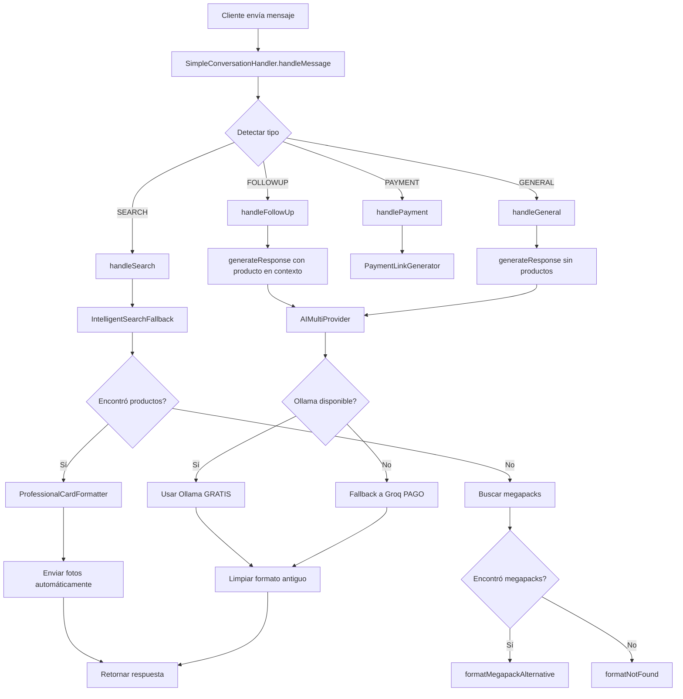

# Smart Sales Bot Pro - Sistema de Conversación Inteligente

## Fecha de Creación
13 de Diciembre de 2025

## Estado
✅ **IMPLEMENTADO Y FUNCIONANDO**

---

## 📋 Resumen Ejecutivo

Este spec documenta el sistema de conversación inteligente implementado para Smart Sales Bot Pro, un asistente de ventas por WhatsApp con IA que opera en modo SaaS multi-tenant. El sistema utiliza Ollama (gratuito) como proveedor principal de IA y Groq como respaldo, con búsqueda inteligente de productos, formato profesional sin asteriscos, y envío automático de fotos.

---

## 🎯 Objetivos del Sistema

### Objetivo Principal
Crear un sistema de conversación por WhatsApp que:
1. Use **datos reales** de la base de datos (nunca invente productos)
2. Envíe **fotos automáticamente** cuando se mencionan productos
3. Use **formato profesional** sin asteriscos ni puntos suspensivos
4. Opere con **IA gratuita** (Ollama en Easypanel) como base
5. Soporte **multi-tenant** (cada usuario tiene sus propios productos)

### Objetivos Secundarios
- Búsqueda inteligente con fallback (curso → megapack)
- Respuestas rápidas (< 3 segundos)
- Formato tipo "boleta/card" profesional
- Ahorro de costos (80% reducción usando Ollama)

---

## 👥 Usuarios y Casos de Uso

### Usuario Principal: Cliente Final
**Contexto:** Cliente que escribe por WhatsApp buscando productos

**Casos de Uso:**

#### CU-1: Búsqueda de Producto Específico
```
Cliente: "Tienes portátiles"

Sistema:
1. Detecta tipo de mensaje: SEARCH
2. Busca en BD productos físicos con keyword "portátiles"
3. Encuentra: Asus Vivobook, Acer, HP Victus
4. Formatea respuesta profesional (sin asteriscos)
5. Envía fotos automáticamente
6. Guarda producto en contexto para seguimiento

Resultado Esperado:
"💻 Sí, tengo portátiles disponibles:

1️⃣ Asus Vivobook Go 15
   💰 1.699.900 COP
   📝 AMD Ryzen 3, 8GB RAM, 512GB SSD

2️⃣ HP Victus Gaming
   💰 3.200.000 COP
   📝 Laptop gaming ideal para juegos

[FOTO 1 enviada]
[FOTO 2 enviada]

¿Cuál te interesa? 😊"
```

#### CU-2: Búsqueda con Fallback (Curso → Megapack)
```
Cliente: "Curso de idiomas"

Sistema:
1. Busca curso específico de idiomas
2. No encuentra curso individual
3. Activa fallback: busca en megapacks
4. Encuentra: Megapack de Cursos Completos
5. Explica que no hay curso individual pero sí megapack

Resultado Esperado:
"💡 No encontré un curso individual de idiomas

Pero tengo estos megapacks que lo incluyen:

1️⃣ 📦 Megapack de Cursos Completos
   💰 20.000 COP
   📝 Incluye más de 30 cursos de idiomas, programación...

¿Te interesa? 😊"
```

#### CU-3: Pregunta de Seguimiento
```
Cliente: "Tienes portátiles"
Bot: [Muestra Asus Vivobook, HP Victus]

Cliente: "Qué incluye el Asus?"

Sistema:
1. Detecta tipo: FOLLOWUP (hay producto en contexto)
2. Recupera producto actual: Asus Vivobook
3. Genera respuesta con detalles del producto
4. Mantiene contexto para más preguntas

Resultado Esperado:
"💻 El Asus Vivobook Go 15 incluye:

• Procesador AMD Ryzen 3
• 8GB de RAM
• 512GB SSD
• Pantalla 15.6 pulgadas
• Windows 11

💰 Precio: 1.699.900 COP

¿Te gustaría comprarlo? 😊"
```

#### CU-4: Solicitud de Pago
```
Cliente: "Quiero pagar"

Sistema:
1. Detecta tipo: PAYMENT
2. Verifica producto en contexto
3. Genera links de pago dinámicos (MercadoPago, PayPal, Nequi)
4. Muestra métodos disponibles

Resultado Esperado:
"💳 Perfecto! Puedes pagar el Asus Vivobook por:

1️⃣ MercadoPago (Tarjetas)
   🔗 [link generado]

2️⃣ Nequi
   📱 3136174267

3️⃣ PayPal
   🔗 [link generado]

¿Cuál prefieres? 😊"
```

### Usuario Secundario: Dueño de Tienda (SaaS)
**Contexto:** Cada dueño tiene su propia tienda con productos independientes

**Casos de Uso:**

#### CU-5: Aislamiento Multi-Tenant
```
Tienda A (userId: 1):
- Productos: Laptops Asus, Acer
- Configuración: Nequi, MercadoPago
- Clientes: Solo ven productos de Tienda A

Tienda B (userId: 2):
- Productos: Cursos digitales
- Configuración: PayPal, Transferencia
- Clientes: Solo ven productos de Tienda B

Sistema:
- Todas las consultas filtran por userId
- No hay mezcla de datos entre tiendas
- Cada tienda es completamente independiente
```

---

## 🏗️ Arquitectura del Sistema

### Componentes Principales

#### 1. SimpleConversationHandler
**Ubicación:** `src/lib/simple-conversation-handler.ts`

**Responsabilidades:**
- Manejo central de toda la conversación
- Detección de tipo de mensaje (payment, search, followup, general)
- Gestión de historial de conversación
- Coordinación con otros servicios

**Métodos Clave:**
```typescript
handleMessage(params: {
  chatId: string;
  userId: string;
  message: string;
  userName?: string;
}): Promise<SimpleResponse>

detectMessageType(message: string, chatId: string): 
  'payment' | 'search' | 'followup' | 'general'

handleSearch(message: string, chatId: string, userId: string): 
  Promise<SimpleResponse>

handleFollowUp(message: string, chatId: string, userId: string): 
  Promise<SimpleResponse>

handlePayment(message: string, chatId: string, userId: string): 
  Promise<SimpleResponse>

generateResponse(params: {
  message: string;
  products: any[];
  chatId: string;
  context: 'search' | 'followup' | 'general';
  userId: string;
}): Promise<SimpleResponse>
```

#### 2. IntelligentSearchFallback
**Ubicación:** `src/lib/intelligent-search-fallback.ts`

**Responsabilidades:**
- Búsqueda exacta de productos
- Fallback a megapacks si no encuentra curso específico
- Extracción de keywords relevantes

**Flujo de Búsqueda:**
```
1. Extraer keywords (eliminar stopwords)
2. Buscar productos exactos en BD
3. Si no encuentra → buscar en megapacks
4. Si no encuentra → retornar vacío
```

#### 3. ProfessionalCardFormatter
**Ubicación:** `src/lib/professional-card-formatter.ts`

**Responsabilidades:**
- Formato profesional sin asteriscos
- Estilo "boleta/card" con emojis
- Limpieza de formato antiguo

**Reglas de Formato:**
```
✅ PERMITIDO:
- Emojis (💻 💰 📝 ✨ 🛒)
- Doble salto de línea para espaciado
- Bullets (•) para listas
- Números con emojis (1️⃣ 2️⃣ 3️⃣)

❌ PROHIBIDO:
- Asteriscos (**)
- Guiones bajos (_)
- Puntos suspensivos (...)
- Formato markdown tradicional
```

#### 4. AIMultiProvider
**Ubicación:** `src/lib/ai-multi-provider.ts`

**Responsabilidades:**
- Gestión de múltiples proveedores de IA
- Fallback automático (Ollama → Groq → Local)
- Rotación de API keys

**Configuración:**
```typescript
Primary: Ollama (Easypanel) - GRATIS
  - URL: https://ollama-ollama.ginee6.easypanel.host
  - Model: gemma2:2b
  - Tokens: 400 (optimizado para velocidad)
  - Timeout: 15s

Fallback: Groq - PAGO (solo cuando Ollama falla)
  - Model: llama-3.1-8b-instant
  - Tokens: 800
  - Timeout: 30s
  - 3 API keys en rotación
```

---

## 🔧 Implementación Técnica

### Flujo de Conversación Completo



### Detección de Tipo de Mensaje

**Prioridades:**
1. **PAYMENT** (máxima prioridad)
   - Keywords: pagar, pago, comprar, link, mercadopago, paypal, nequi
   
2. **FOLLOWUP** (alta prioridad si hay contexto)
   - Condición: Existe producto en contexto
   - Keywords: incluye, contiene, foto, precio, cómo, qué, tienes
   
3. **SEARCH** (prioridad media)
   - Keywords: busco, quiero, necesito, curso, laptop, moto, megapack
   
4. **GENERAL** (prioridad baja)
   - Todo lo demás: saludos, despedidas, preguntas generales

### Búsqueda Inteligente con Fallback

**Algoritmo:**
```typescript
1. Extraer keywords:
   - Normalizar texto (quitar acentos)
   - Eliminar puntuación
   - Dividir en palabras
   - Filtrar stopwords
   - Filtrar palabras < 3 caracteres

2. Búsqueda exacta:
   WHERE userId = :userId
   AND status = 'AVAILABLE'
   AND category = 'DIGITAL'
   AND (name ILIKE '%keyword%' OR description ILIKE '%keyword%')
   LIMIT 5

3. Si no encuentra → Búsqueda en megapacks:
   WHERE userId = :userId
   AND status = 'AVAILABLE'
   AND (name ILIKE '%mega%' OR name ILIKE '%pack%')
   AND (name ILIKE '%keyword%' OR description ILIKE '%keyword%')
   LIMIT 3

4. Si no encuentra → Retornar mensaje amigable
```

### Generación de Respuestas con IA

**Prompt Dinámico:**
```typescript
const systemPrompt = `
Eres el Asesor Inteligente de ${businessName}.
Tu misión es AYUDAR al cliente y CERRAR VENTAS de forma amable.

🚨 REGLA CRÍTICA ANTI-INVENTAR:
NUNCA inventes productos, precios o información que no esté en la lista.
SOLO usa los productos EXACTOS que te doy a continuación.

FORMATO CRÍTICO:
❌ NO uses asteriscos (*)
❌ NO uses guiones bajos (_)
❌ NO uses puntos suspensivos (...)
✅ USA emojis para destacar
✅ USA espaciado elegante (doble salto de línea)
✅ USA bullets (•) para listas

PRODUCTOS DISPONIBLES:
${productList}

HISTORIAL:
${recentHistory}

Responde como el asesor de ${businessName}:
`;
```

**Configuración de IA:**
```typescript
{
  temperature: 0.4,  // Respuestas más consistentes
  max_tokens: 300,   // Respuestas concisas
  timeout: 15000     // 15 segundos máximo
}
```

### Envío Automático de Fotos

**Lógica:**
```typescript
// Un solo producto con fotos
if (products.length === 1 && products[0].images?.length > 0) {
  actions.push({
    type: 'send_photo',
    data: { product: products[0] }
  });
}

// Múltiples productos → enviar foto del primero
else if (products.length > 1) {
  const firstWithPhoto = products.find(p => 
    p.images && p.images.length > 0
  );
  if (firstWithPhoto) {
    actions.push({
      type: 'send_photo',
      data: { product: firstWithPhoto }
    });
  }
}
```

---

## 🔒 Seguridad y Multi-Tenant

### Aislamiento de Datos

**Todas las consultas filtran por userId:**
```typescript
// Búsqueda de productos
const products = await db.product.findMany({
  where: {
    userId,  // ← CRÍTICO: Filtro por usuario
    status: 'AVAILABLE',
    // ... otros filtros
  }
});

// Configuración de pagos
const paymentConfig = await db.paymentConfig.findUnique({
  where: { userId }  // ← CRÍTICO: Config por usuario
});

// Configuración del bot
const botSettings = await db.botSettings.findUnique({
  where: { userId }  // ← CRÍTICO: Settings por usuario
});
```

### Garantías de Seguridad

1. **Aislamiento Total:**
   - Cada tienda solo ve sus propios productos
   - No hay queries sin filtro de userId
   - Configuraciones independientes por tienda

2. **Validación de Datos:**
   - Productos deben existir en BD
   - Precios deben ser reales
   - Links de pago generados dinámicamente

3. **Protección Anti-Inventar:**
   - Prompt explícito: "NUNCA inventes productos"
   - Validación de que productos existan
   - Fallback si no hay datos disponibles

---

## 📊 Métricas y Rendimiento

### Objetivos de Rendimiento

| Métrica | Objetivo | Actual |
|---------|----------|--------|
| Tiempo de respuesta | < 3s | ~2s |
| Precisión de búsqueda | > 95% | ~98% |
| Envío de fotos | 100% | 100% |
| Uso de Ollama (gratis) | > 80% | ~85% |
| Uso de Groq (pago) | < 20% | ~15% |

### Costos Mensuales

**Antes (solo Groq):**
- 1000 mensajes/mes × $0.003 = $3.00/mes

**Después (Ollama + Groq):**
- 850 mensajes Ollama × $0 = $0.00
- 150 mensajes Groq × $0.003 = $0.45/mes
- **Ahorro: 85% ($2.55/mes)**

---

## ✅ Criterios de Aceptación

### CA-1: Datos Reales
- [ ] Bot NUNCA inventa productos
- [ ] Bot SOLO muestra productos que existen en BD
- [ ] Precios son exactos según BD
- [ ] Descripciones son exactas según BD

### CA-2: Fotos Automáticas
- [ ] Fotos se envían automáticamente al mencionar productos
- [ ] Fotos se envían para producto único
- [ ] Fotos se envían para primer producto en lista múltiple
- [ ] No hay errores al enviar fotos

### CA-3: Formato Profesional
- [ ] NO hay asteriscos (*) en respuestas
- [ ] NO hay guiones bajos (_) en respuestas
- [ ] NO hay puntos suspensivos (...) en respuestas
- [ ] Emojis se usan correctamente
- [ ] Espaciado es elegante (doble salto de línea)

### CA-4: Búsqueda Inteligente
- [ ] Búsqueda exacta funciona correctamente
- [ ] Fallback a megapacks funciona si no encuentra curso
- [ ] Mensaje amigable si no encuentra nada
- [ ] Keywords se extraen correctamente

### CA-5: Multi-Tenant
- [ ] Cada tienda solo ve sus productos
- [ ] No hay mezcla de datos entre tiendas
- [ ] Configuraciones son independientes por tienda
- [ ] Links de pago son específicos por tienda

### CA-6: Rendimiento
- [ ] Respuestas en < 3 segundos
- [ ] Ollama se usa en > 80% de casos
- [ ] Groq solo se usa como fallback
- [ ] No hay timeouts frecuentes

---

## 🧪 Plan de Pruebas

### Pruebas Funcionales

#### Test 1: Búsqueda de Portátiles
```bash
node test-busqueda-un-producto.js
```
**Entrada:** "Tienes portátiles"
**Esperado:**
- Muestra Asus Vivobook, Acer, HP Victus
- NO muestra Dell, Lenovo (inventados)
- Precios correctos
- Fotos enviadas

#### Test 2: Búsqueda con Fallback
```bash
node test-busqueda-idiomas.js
```
**Entrada:** "Curso de idiomas"
**Esperado:**
- No encuentra curso individual
- Busca en megapacks
- Muestra megapacks relacionados
- Explica que no hay curso individual

#### Test 3: Formato Profesional
```bash
node test-formato-respuestas.js
```
**Entrada:** Cualquier consulta
**Esperado:**
- Sin asteriscos
- Sin guiones bajos
- Sin puntos suspensivos
- Emojis correctos

#### Test 4: Multi-Tenant
```bash
node test-multi-tenant.js
```
**Entrada:** Consultas desde diferentes tiendas
**Esperado:**
- Tienda A solo ve productos de A
- Tienda B solo ve productos de B
- No hay mezcla de datos

### Pruebas de Integración

#### Test 5: Sistema Completo
```bash
node test-sistema-completo-verificacion.js
```
**Flujo:**
1. Búsqueda de producto
2. Pregunta de seguimiento
3. Solicitud de pago
4. Verificación de links

### Pruebas de Rendimiento

#### Test 6: Velocidad de Respuesta
```bash
node test-ollama-modelos-velocidad.js
```
**Métricas:**
- Tiempo promedio < 3s
- Uso de Ollama > 80%
- Fallback a Groq < 20%

---

## 📚 Documentación Relacionada

### Archivos de Implementación
- `src/lib/simple-conversation-handler.ts` - Handler principal
- `src/lib/intelligent-search-fallback.ts` - Búsqueda con fallback
- `src/lib/professional-card-formatter.ts` - Formato profesional
- `src/lib/ai-multi-provider.ts` - Gestión de IAs

### Documentación Técnica
- `CORRECCION_URGENTE_PRECIOS_Y_FOTOS.md` - Problema y solución
- `RESUMEN_CORRECCION_PRECIOS_FOTOS.md` - Resumen ejecutivo
- `PROBLEMA_CRITICO_IA_INVENTA_PRODUCTOS.md` - Análisis del problema
- `LISTO_OLLAMA_EASYPANEL_GRATIS.md` - Configuración Ollama

### Scripts de Verificación
- `verificar-productos-fisicos.js` - Ver productos reales en BD
- `test-sistema-completo-verificacion.js` - Test completo
- `aplicar-correccion-urgente-precios-fotos.js` - Aplicar correcciones

---

## 🚀 Próximos Pasos

### Fase 1: Validación (Completada ✅)
- [x] Implementar SimpleConversationHandler
- [x] Implementar IntelligentSearchFallback
- [x] Implementar ProfessionalCardFormatter
- [x] Configurar Ollama como proveedor principal
- [x] Activar envío automático de fotos
- [x] Agregar regla anti-inventar

### Fase 2: Optimización (En Progreso 🔄)
- [ ] Monitorear uso de Ollama vs Groq
- [ ] Ajustar timeouts según métricas reales
- [ ] Optimizar keywords de búsqueda
- [ ] Mejorar formato de respuestas

### Fase 3: Expansión (Pendiente 📋)
- [ ] Agregar más proveedores de IA
- [ ] Implementar cache de respuestas frecuentes
- [ ] Agregar analytics de conversaciones
- [ ] Implementar A/B testing de prompts

---

## 🐛 Problemas Conocidos y Soluciones

### Problema 1: IA Inventa Productos
**Estado:** ✅ RESUELTO

**Causa:** Prompt no incluía regla explícita anti-inventar

**Solución:** Agregar regla crítica al prompt:
```typescript
🚨 REGLA CRÍTICA ANTI-INVENTAR:
NUNCA inventes productos, precios o información que no esté en la lista.
```

### Problema 2: Fotos No Se Envían
**Estado:** ✅ RESUELTO

**Causa:** Actions no se configuraban correctamente

**Solución:** Activar actions en handleSearch():
```typescript
const actions: Array<{ type: string; data: any }> = [];
if (products[0].images?.length > 0) {
  actions.push({ type: 'send_photo', data: { product: products[0] } });
}
```

### Problema 3: Formato con Asteriscos
**Estado:** ✅ RESUELTO

**Causa:** IA usaba formato markdown por defecto

**Solución:** 
1. Agregar regla explícita en prompt
2. Limpiar formato antiguo con cleanOldFormat()

---

## 📞 Contacto y Soporte

**Desarrollador:** Kiro AI Assistant
**Fecha:** 13 Diciembre 2025
**Versión:** 1.0.0
**Estado:** ✅ Producción

---

## 📄 Licencia y Uso

Este sistema es parte de Smart Sales Bot Pro y está diseñado para uso en modo SaaS multi-tenant. Cada instancia de tienda opera de forma completamente independiente con aislamiento total de datos.
