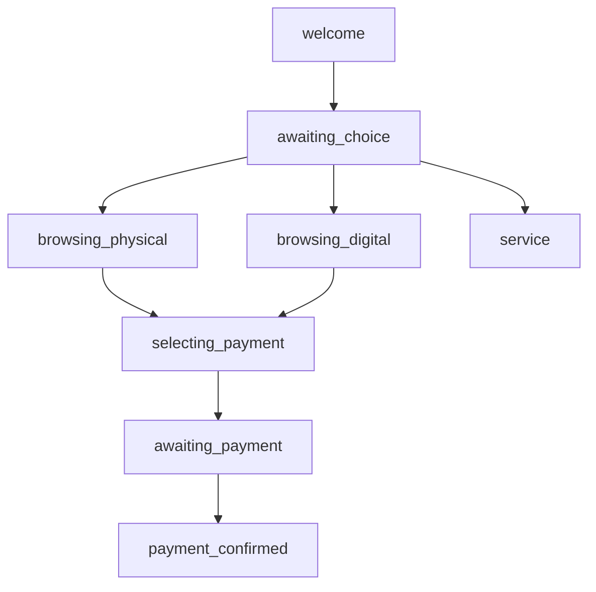

# Sistema FlowEngine Inteligente - Documentación Completa

## 🎯 Descripción General

El **FlowEngine** es un sistema conversacional avanzado que maneja el flujo completo de ventas por WhatsApp, con detección inteligente de intenciones de pago y generación automática de links dinámicos.

## ✨ Características Principales

### 1. Detección Inteligente de Intenciones de Pago

El sistema detecta automáticamente cuando un usuario quiere pagar, sin importar cómo lo exprese:

**Frases detectadas:**
- "Quiero pagar"
- "Envíame el link de pago"
- "¿Cómo puedo pagar?"
- "Dame el enlace"
- "Link de compra"
- "Finalizar compra"
- "Link de MercadoPago"
- "Link de PayPal"
- Y muchas más variaciones...

### 2. Generación Automática de Links de Pago

Cuando se detecta una intención de pago:
1. Identifica el producto en contexto
2. Detecta el método de pago preferido (MercadoPago, PayPal, Nequi, Daviplata)
3. Genera el link dinámico desde la API
4. Envía respuesta visual con emojis y botones
5. Guarda la orden en el contexto

### 3. Máquina de Estados Conversacional

El sistema mantiene el estado de cada conversación:

```
welcome → awaiting_choice → browsing_physical/digital → 
selecting_payment → awaiting_payment → payment_confirmed
```

### 4. Contexto Persistente

Cada sesión mantiene:
- Producto seleccionado
- Orden creada
- Método de pago elegido
- Historial de mensajes (últimos 20)
- Estado actual de la conversación

## 📁 Estructura de Archivos

```
src/lib/
├── plantillas-respuestas-bot.ts      # Motor principal del FlowEngine
├── flow-integration.ts                # Integración con Baileys
└── flow-baileys-integration.ts       # Wrapper para reemplazar clean-bot

scripts/
└── test-flow-engine.ts               # Script de pruebas
```

## 🚀 Uso Básico

### Opción 1: Integración Directa en Baileys

```typescript
import { FlowIntegration } from './lib/flow-integration';

// En el manejador de mensajes de Baileys
socket.ev.on('messages.upsert', async ({ messages }) => {
  for (const message of messages) {
    const chatId = message.key.remoteJid;
    const text = message.message?.conversation || '';
    
    await FlowIntegration.processMessage({
      sock: socket,
      chatId,
      userName: 'Usuario',
      text
    });
  }
});
```

### Opción 2: Reemplazar clean-bot

En `baileys-stable-service.ts`, reemplazar:

```typescript
// ❌ Sistema antiguo
const { handleMessage } = await import('../clean-bot');
const response = await handleMessage(from, messageText, userId);

// ✅ Sistema nuevo
import { handleMessageWithFlowEngine } from './flow-baileys-integration';
const result = await handleMessageWithFlowEngine({
  sock: socket,
  userId,
  from,
  messageText,
  conversationId: conversation.id
});
```

## 🧪 Pruebas

### Ejecutar pruebas del FlowEngine

```bash
npx tsx scripts/test-flow-engine.ts
```

### Escenarios de prueba incluidos:

1. ✅ Saludo inicial
2. ✅ Consulta de productos
3. ✅ Solicitud de fotos
4. ✅ Intención de pago directa
5. ✅ Solicitud de link de pago
6. ✅ Consulta de métodos de pago
7. ✅ Especificar método de pago
8. ✅ Confirmar pago realizado

## 💡 Ejemplos de Conversación

### Ejemplo 1: Flujo Completo de Compra

```
👤 Usuario: Hola
🤖 Bot: ¡Hola! 👋 Bienvenido a Tecnovariedades D&S...

👤 Usuario: Quiero ver laptops
🤖 Bot: 🔎 *Laptop Pro X14*
        Precio: $1,899,000 COP
        [Botones: Fotos | Comprar | Comparar]

👤 Usuario: Quiero comprar
🤖 Bot: 💰 Actualmente aceptamos los siguientes métodos...
        [Botones: MercadoPago | PayPal | Nequi]

👤 Usuario: Envíame el link de MercadoPago
🤖 Bot: 💳 *¡Perfecto!*
        Aquí tienes tu link seguro de pago...
        👉 https://mpago.la/xxx
        [Botones: Ya pagué | Cambiar método | Ver otros]
```

### Ejemplo 2: Detección Inteligente

```
👤 Usuario: ¿Cómo puedo pagar esto?
🤖 Bot: [Detecta intención de pago]
        💰 Actualmente aceptamos...

👤 Usuario: Dame el link de PayPal
🤖 Bot: [Detecta método PayPal]
        💳 Aquí tienes tu link de PayPal...
```

## 🔧 Configuración

### Variables de Entorno Necesarias

```env
# API de pagos
NEXT_PUBLIC_APP_URL=https://tu-dominio.com

# Groq para IA (opcional, para fallback)
GROQ_API_KEY=tu_api_key

# Credenciales de pago
MERCADOPAGO_ACCESS_TOKEN=tu_token
PAYPAL_CLIENT_ID=tu_client_id
PAYPAL_CLIENT_SECRET=tu_secret
```

### Personalización de Plantillas

Editar `src/lib/plantillas-respuestas-bot.ts`:

```typescript
export const Templates = {
  meta: {
    brandName: 'Tu Marca',
    businessPhone: '+57 XXX XXX XXXX',
    supportEmail: 'soporte@tumarca.com'
  },
  messages: {
    welcome: `Tu mensaje de bienvenida personalizado...`,
    // ... más plantillas
  }
};
```

## 📊 API del FlowEngine

### Clase Principal: `FlowEngine`

```typescript
class FlowEngine {
  // Obtener sesión de un chat
  getSession(chatId: string): ConversationSession
  
  // Procesar mensaje entrante
  async handleIncoming(params: {
    chatId: string;
    userName?: string;
    text: string;
    raw?: any;
  }): Promise<Response[]>
  
  // Agregar mensaje al historial
  pushHistory(chatId: string, from: string, text: string): void
}
```

### Clase: `PaymentIntentDetector`

```typescript
class PaymentIntentDetector {
  // Detectar intención de pago
  static detectIntent(text: string): 'payment_request' | 'payment_methods' | null
  
  // Detectar método de pago
  static detectPaymentMethod(text: string): 'mercadopago' | 'paypal' | 'nequi' | 'daviplata' | null
}
```

### Clase: `PaymentLinkGenerator`

```typescript
class PaymentLinkGenerator {
  // Generar link de pago
  static async generateLink(params: {
    productId: string;
    productName: string;
    amount: number;
    method: string;
    userId?: string;
  }): Promise<string>
}
```

## 🎨 Tipos de Respuestas

El FlowEngine genera diferentes tipos de respuestas:

### 1. Texto Simple
```typescript
{ type: 'text', text: 'Mensaje de texto' }
```

### 2. Botones
```typescript
{
  type: 'buttons',
  text: 'Mensaje con opciones',
  buttons: [
    { id: 'btn1', text: 'Opción 1' },
    { id: 'btn2', text: 'Opción 2' }
  ]
}
```

### 3. Lista
```typescript
{
  type: 'list',
  title: 'Título de la lista',
  sections: [
    {
      title: 'Sección 1',
      rows: [
        { id: 'item1', title: 'Item 1', description: 'Descripción' }
      ]
    }
  ]
}
```

### 4. Imagen
```typescript
{
  type: 'image',
  url: 'https://...',
  caption: 'Descripción de la imagen'
}
```

## 🔄 Flujo de Estados



## 🛠️ Mantenimiento

### Limpiar Sesión

```typescript
FlowIntegration.clearSession(chatId);
```

### Obtener Historial

```typescript
const history = FlowIntegration.getHistory(chatId);
```

### Obtener Estadísticas

```typescript
import { FlowBaileysIntegration } from './lib/flow-baileys-integration';

const stats = FlowBaileysIntegration.getSessionStats(chatId);
// {
//   state: 'awaiting_payment',
//   messageCount: 15,
//   hasProduct: true,
//   hasOrder: true,
//   paymentMethod: 'mercadopago'
// }
```

## 🚨 Solución de Problemas

### Problema: Links de pago no se generan

**Solución:**
1. Verificar que `NEXT_PUBLIC_APP_URL` esté configurado
2. Verificar que la API `/api/payments/generate-link` esté funcionando
3. Revisar logs del servidor

### Problema: No detecta intenciones de pago

**Solución:**
1. Verificar que las frases estén en español
2. Agregar más variaciones en `PaymentIntentDetector.paymentIntents`
3. Revisar logs de detección

### Problema: Sesiones se pierden

**Solución:**
1. Las sesiones están en memoria, se pierden al reiniciar
2. Para persistencia, implementar guardado en Redis o DB
3. Usar `getSession()` para recuperar estado

## 📈 Próximas Mejoras

- [ ] Persistencia de sesiones en Redis
- [ ] Integración con webhooks de pago
- [ ] Confirmación automática de pagos
- [ ] Soporte para múltiples productos en una orden
- [ ] Sistema de descuentos y cupones
- [ ] Notificaciones de seguimiento post-venta
- [ ] Analytics de conversiones

## 📝 Notas Importantes

1. **Compatibilidad**: Compatible con Baileys v7.0.0-rc.6
2. **Rendimiento**: Mantiene solo últimos 20 mensajes en historial
3. **Seguridad**: Links de pago tienen expiración automática
4. **Escalabilidad**: Diseñado para múltiples usuarios simultáneos

## 🤝 Contribuir

Para agregar nuevas intenciones o plantillas:

1. Editar `PaymentIntentDetector` para nuevas intenciones
2. Agregar plantillas en `Templates.messages`
3. Crear handlers en `FlowEngine.handleIntent()`
4. Agregar pruebas en `test-flow-engine.ts`

## 📞 Soporte

Para dudas o problemas:
- Revisar logs del servidor
- Ejecutar script de pruebas
- Verificar configuración de variables de entorno

---

**Versión:** 1.0.0  
**Última actualización:** 2025-11-10  
**Autor:** Smart Sales Bot Pro Team
